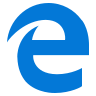

<section>

<h3 class="page-header">Getting Started</h3>

#### Using BHP Digital Design System (DDS) Components

Our components are a collection of front-end interface elements that can be reused across the BHP browser-based products.

We offer four variations of components — React, HTML, CSS and Angular variations where applicable. If your project can utilise React components then it is recommended to use these going forward. Using React components in your project enables BHP to adhere to a consistent interactive experience that will scale over time and help reduce technical debt throughout our web-based product lines.

#### React widgets

Our BHP widget repository contains the common React widgets used by our web-based products. You will need private Github access to this repository to begin working with BHP widgets at this stage. Please contact your dev manager to enable this. Always visit the Github repository for latest updates.

##### Contributing to our React widgets

We encourage all BHP developers to contribute to our React widget library.

##### Browser support

Our React and HTML components are designed to work as intended in the following browsers:

  

    

    
<strong>Internet Explorer 10</strong>

    
(or later)

  

  

    

    
<strong>Chrome</strong>

    
(latest two versions)

  

  

    

    
<strong>Firefox</strong>

    
(latest two versions)

  

  

    

    
<strong>Safari</strong>

    
(latest two versions)

  

#### Third party installation of this project

The project is available as an NPM package and deployed in our private NPM registry: 
https://npm.addevcloudservices.com.au/

For information about how to access our NPM registry, look here: 
https://******BHP link*******

The dist directory contains the pre-packaged distributable files.

</section>
