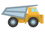

<section>

<h3 class="page-header">Icons</h3>

We are promoting the use of [Material design font icons](/foundation/font-icons/).

When you have to use a special icon (product / event / campaign) we advise using SVG formats only.

When creating stand alone icons, products icons, and event icons, ensure that you keep the style, weight and size consistent with the Material Font Icons.  All custom icons must be pixel perfect.

To explore the custom icons library, please go to the [download page](/download/).

<h4 class="h4-light">Styling</h4>

<i class="material-icons md-18 align-top">clear</i> WRONG 

This icon does not follow the precise and colour neutral style preferred for BHP Digital styling.

<i class="material-icons md-18 align-top">done</i> CORRECT 

Clean, precise, colour neutral and a smart use of negative space is preferred.

</section>